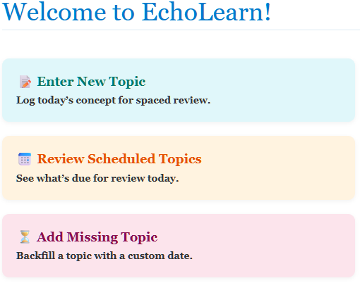
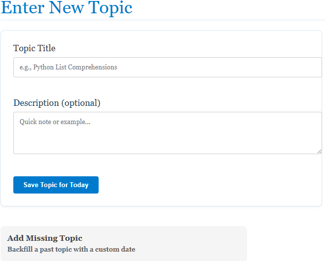
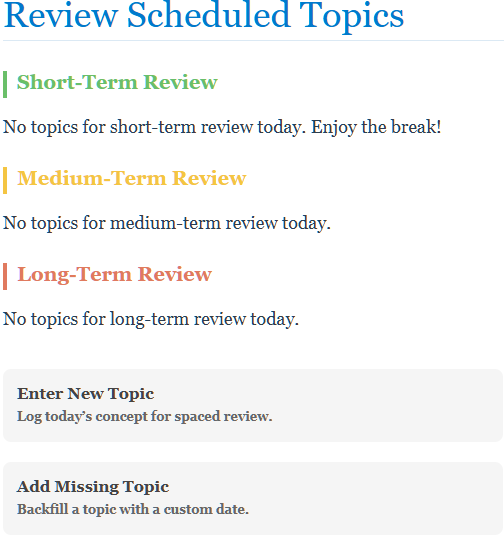

# EchoLearn: Spaced-Repetition Scheduler for Educators

**Live Demo**: [https://echolearn-2voe.onrender.com](https://echolearn-2voe.onrender.com)

## Overview
EchoLearn is a web-based prototype tool that automates personalized review scheduling for students using the **Ebbinghaus Forgetting Curve**. As a former high school math teacher, I built this to solve real classroom retention challenges—helping educators input topics and get automatic, weekend-aware review dates (e.g., 2, 4, 14, 35 days intervals with adjustments).

This project bridges education, data-driven algorithms, and full-stack development—perfect for demonstrating applied data science principles like algorithmic scheduling and persistent data tracking.

## Key Features
- **Topic & schedule entry** for quick setup
- **Personalized intervals** based on Ebbinghaus curve
- **Weekend-aware logic** (skips non-school days)
- **Persistent tracking** via SQLite (review history per topic/student)
- **Simple educator dashboard** for viewing upcoming reviews

## Tech Stack
- **Backend**: Python, Flask, SQLAlchemy (ORM), SQLite
- **Frontend**: HTML/CSS (Jinja templates)
- **Deployment**: Render (free tier, auto-build from GitHub)

## Screenshots

  
*Main dashboard with navigation to enter/review topics*

---

  
*Form for adding a topic and setting initial review date*

---

  
*Example of personalized spaced-repetition schedule output*
---
## What I Learned / DS Relevance
- Implemented custom scheduling logic (math + date handling) to model forgetting curves—ties directly to operations research/optimization interests.
- Handled persistent data with SQLAlchemy (joins/queries for review history).
- Full end-to-end deployment (Git → Render), including Procfile for production.
- Focused on user-centric design (teacher pain points) → strong data storytelling/communication angle from my teaching background.

## Setup (Local)
1. Clone: `git clone https://github.com/lbedroske/EchoLearn.git`
2. Install: `pip install -r requirements.txt`
3. Run: `python app.py`
4. Visit: http://localhost:5000

Open to feedback/collaboration—especially for expanding to analytics dashboards (e.g., retention metrics over time).

Built by Lucas Bedroske | Aspiring Data Scientist | [LinkedIn](http://www.linkedin.com/in/lucas-bedroske-2a792432b) | [@LBedroske on X]
